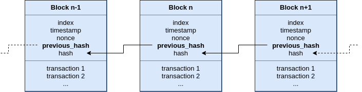

# rust-blockchain
A simple blockchain example written in Rust:
* Defines data structures to model a minimum blockchain
* Mines new blocks in a separate thread, running a Proof of Work algorithm with a fixed difficulty
* Provides a REST API to retrieve the blocks and add transactions

## Getting Started
You will need Rust and Cargo installed.

```bash
# Download the code
$ git clone https://github.com/mrnaveira/rust-blockchain
$ cd rust-blockchain

# Run all tests
$ cargo test

# Build the project in release mode
$ cargo build --release

# Run the application
$ ./target/release/rust_blockchain
```

The application will start mining and listening on port 8000 for incoming client requests via REST API.

For development setup, check the [development setup section](#development-setup).

## Client REST API
The application provides a REST API for clients to operate with the blockchain.

| Method | URL | Description
| --- | --- | --- |
| GET | /blocks | List all blocks of the blockchain <br /> `curl -X GET http://localhost:8000/blocks`
| POST | /transactions | Add a new transaction to the pool <br /> `curl -X POST http://localhost:8000/transactions -H 'Content-Type: application/json' -d '{"sender": "1", "recipient": "2", "amount": 1002}'`

The file `doc/rest_api.postman_collection.json` contains a Postman collection with examples of all requests.

## Block Structure

In a blockchain, transactions are grouped into blocks. Aside from transactions, a block contains metadata needed to secure and maintain the sequence in the chain. This sequence of blocks is key to allow transactions to occur in order.

The `blockchain` module in this project contains the data structures to model the blockchain, as described in the next diagram:



Each block contains the following data:
* **index**: position of the block in the blockchain
* **timestamp**: date and time of block creation
* **nonce**: arbitrary number that makes the block, when hashed, meet the mining difficulty restriction. Is the number that miners are competing to get first
* **previous_hash**: hash of the previous block in the chain. Allows to maintain order of blocks in the blockchain. There is an exception with the first block of the chain (genesis block) which has no previous_hash
* **hash**: hash of the block including all fields
* **transactions**: a list of all transactions included in the block. Each transaction has a **sender**, **recipient** and **amount**.

## Proof of Work

Proof of Work (PoW) is a common consensus algorithm used widely in most cryptocurrencies like Bitcoin. A participant node in the network that wants to add new transactions in the blockchain (and get the rewards for it) must prove that a certain amount of computational work has been done. This work can take a large amount of time to do but at the same time it's very easy to validate by other nodes.

This prevents the double spending problem by forcing any attacker that wants to remove or modify a transaction to redo all the computational work from the target block to the current one. The attacker must have a larger computational capacity than the rest of the network combined to be able to achieve it (51% attack). 

This project implements a simplified PoW algorithm based on hashes, in the line of what Bitcoin does. The `miner.rs` file implements the steps to create a valid block:
1. All transactions in the pool are added to the block. If there is no transactions in the pool, do not mine until they arrive.
2. The block contains the valid index and timestamp, as well as the **hash of the previous block** to maintain order.
3. Iterate the **nonce** value until the hash of the whole block satisfies the difficulty constraint, which is to be less than a target value. The difficulty target is fixed for the execution of the server, but in a real project we would want dynamic difficulty adjusted in runtime to have constant time intervals between blocks.
4. When a valid block is found, add it to the blockchain and repeat from step 1 to create the next block.

## Development setup

This project uses [cargo-husky](https://github.com/rhysd/cargo-husky) to setup a Git pre-commit hook to check code style (using [clippy](https://github.com/rust-lang/rust-clippy) and [rustfmt](https://github.com/rust-lang/rustfmt)), cargo dependencies and run all tests. If any of those tasks fails, the hook prevents you to commit the changes.

To automatically create the hooks in your local repository, simply run all tests the first time:
```bash
# Run all tests
$ cargo test
```

## Roadmap

- [x] Boilerplate REST API in Rust
- [x] Structs to represent blockchain data
- [x] API methods to add transactions and check blocks
- [x] Transaction pool that holds not realized transactions
- [x] Basic miner that adds transactions every N seconds
- [x] Basic PoW implementation: nonce, miner calculates hashes and fixed difficulty
- [ ] Parallel mining
- [ ] Mining peers communicate new blocks over the network
- [ ] Blockchain disk storage
- [ ] Dynamic difficulty (aiming for constant time intervals between blocks)
- [ ] Block rewards: subsidy and transaction fees
- [ ] Validate transaction balances
- [ ] Halving
- [ ] Digital signing of transactions